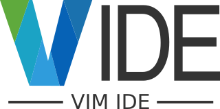
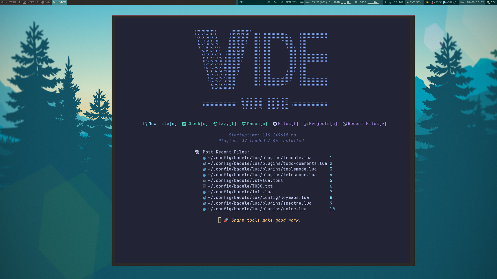
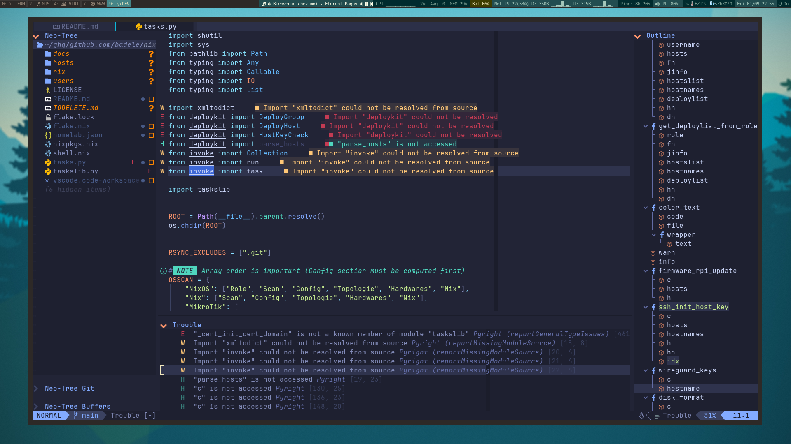
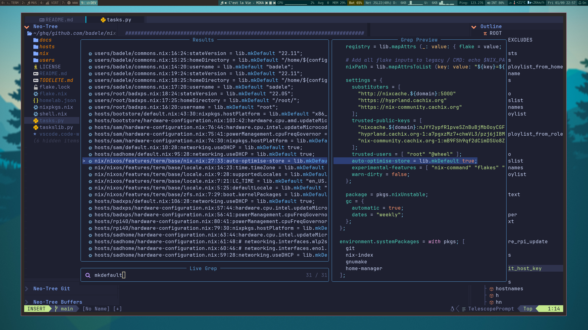
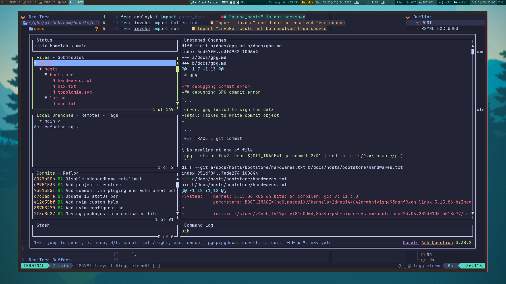

<p align="center">
  
</p>

Welcome to my personalized Neovim configuration! This configuration is tailored
primarily for DevOps tasks but can also be utilized by developers working with
languages like Bash, Go, JSON, Python, Terraform, TypeScript, and more.

I've aimed to streamline the installation process by creating an installation
script based on `flake.nix`

scripts for your preferred distributions (you can even test it on Docker
images).

<!--toc:start-->

- [Features](#features)
- [Plugins](#plugins)
- [Language support](#language-support)
  - [Fully supported](#fully-supported)
  - [Partily supported](#partily-supported)
- [keybinding](#keybinding)
- [Try](#try)
  - [Try on docker image](#try-on-docker-image)
  - [Try on your distribution with nix](#try-on-your-distribution-with-nix)
    - [1) Select nix installation](#1-select-nix-installation)
    - [2) Configure nix](#2-configure-nix)
- [Installation](#installation)
- [Available commands](#available-commands)
  - [TODO](#todo)
- [Credits](#credits)

<!--toc:end-->



 

## Features

- **DevOps-Centric:** This Neovim setup is optimized for DevOps workflows,
  enhancing your efficiency in tasks related to infrastructure, automation, and
  more.
- **Developer-Friendly:** Even if you're a developer working with various
  programming languages such as Bash, Deno, Go, JSON, Nix, Python, Terraform,
  TypeScript, etc., this configuration has you covered.

## Plugins

- ⚙️ **Core**
  - **Neovim 0.10.x**
  - A modern plugin manager for Neovim
    [Lazy](https://github.com/folke/lazy.nvim)
  - Icons package [mini.icons](https://github.com/echasnovski/mini.icons),
    [nvim-web-devicons](https://github.com/nvim-tree/nvim-web-devicons)
  - Folder & code visualiser
    [neotree](https://github.com/nvim-neo-tree/neo-tree.nvim),
    [outline](https://github.com/hedyhli/outline.nvim)
  - Completion engine [cmp](https://github.com/hrsh7th/nvim-cmp)
  - Notification [noice](https://github.com/folke/noice.nvim)
  - Find, Filter, Preview, Pick
    [telescope](https://github.com/nvim-telescope/telescope.nvim),
    [spectre](https://github.com/nvim-pack/nvim-spectre)
  - Improve the default vim.ui interfaces
    [dressing](https://github.com/stevearc/dressing.nvim)
- 🖥️ **Appearance**
  - A clean, dark Neovim colorscheme
    [tokyonight](https://github.com/folke/tokyonight.nvim)
  - A vim-startify like [dashboard](https://github.com/nvimdev/dashboard-nvim)
  - Status line & tabline
    [bufferline](https://github.com/akinsho/bufferline.nvim),
    [lualine](https://github.com/nvim-lualine/lualine.nvim)
  - Easily create and manage predefined window layouts
    [edgy](https://github.com/folke/edgy.nvim)
- 🪟 **IDE**
  - Key bindings that stick [which-key](https://github.com/folke/which-key.nvim)
  - Git integration for buffers
    [gitsigns](https://github.com/lewis6991/gitsigns.nvim),
    [neogit](https://github.com/NeogitOrg/neogit)
  - Indent guides
    [indent_blankline](https://github.com/lukas-reineke/indent-blankline.nvim)
  - AI
    - [Github Copilot](https://github.com/zbirenbaum/copilot.lua)
    - Neovim like using Cursor AI IDE
      [CodeCompanion](https://codecompanion.olimorris.dev/)
    - [Claude Code](https://github.com/greggh/claude-code.nvim)
  - LSP, diagnostic, linting
    - [lspconfig](https://github.com/neovim/nvim-lspconfig),
    - [mason](https://github.com/williamboman/mason.nvim),
    - [none-ls](https://github.com/nvimtools/none-ls.nvim)
    - [treesitter](https://github.com/nvim-treesitter/nvim-treesitter),
    - [trouble](https://github.com/folke/trouble.nvim)
    - [ts-node-action](https://github.com/CKolkey/ts-node-action)
  - Keymap popup [which-key](https://github.com/folke/which-key.nvim)
  - tools
    - Preview markdown result
      [mardown-preview](https://github.com/iamcco/markdown-preview.nvim),
    - Convert ascii to tree
      [asciitree](https://github.com/riddlew/asciitree.nvim)
- ⛏️ External
  - Conventional commits [cocogitto](https://github.com/cocogitto/cocogitto)

## Language support

To add or remove a language, you need to modify the following files:

- `flake.nix`
- `lua/config/options.lua`
- `lua/plugins/code/conform.lua`
- `lua/plugins/code/lspconfig.lua`
- `lua/plugins/code/nvim-lint.lua`
- `lua/plugins/code/treesitter.lua`
- `lua/plugins/editor/filetype.lua`

Language marketplace list:

- [conform.nvim](https://github.com/stevearc/conform.nvim?tab=readme-ov-file#formatters)
- [lspconfig](https://github.com/neovim/nvim-lspconfig/blob/master/doc/server_configurations.md)
- [nvim-lint](https://github.com/mfussenegger/nvim-lint?tab=readme-ov-file#available-linters)
- [nvim-treesitter](https://github.com/nvim-treesitter/nvim-treesitter?tab=readme-ov-file#supported-languages)

The below table show the languages fully supporter (LSP, highlighting, format,
lint/diagnostic, completion, action).

### Fully supported

| Language   | LSP | HL | FO | Lint | cmp | CA | Plugins                                                          |
| ---------- | --- | -- | -- | ---- | --- | -- | ---------------------------------------------------------------- |
| deno       | ✅  | ✅ | ✅ | ✅   | ✅  | ✅ | lspconfig (denols)                                               |
| javascript | ✅  | ✅ | ✅ | ✅   | ✅  | ✅ | lspconfig (denols)                                               |
| dockerfile | ✅  | ✅ | ✅ | ✅   | ✅  | ✅ | lspconfig (dockerls)                                             |
| lua        | ✅  | ✅ | ✅ | ✅   | ✅  | ✅ | lspconfig (lua_ls)                                               |
| markdown   | ✅  | ✅ | ✅ | ✅   | ✅  | ✅ | lspconfig (marksman), nvim-lint(markdownlint), conform(deno_fmt) |
| nix        | ✅  | ✅ | ✅ | ✅   | ✅  | ✅ | lspconfig (nixd, nil_ls)                                         |
| openscad   | ✅  | ✅ | ✅ | ✅   | ✅  | ✅ | lspconfig (openscad-lsp)                                         |
| python     | ✅  | ✅ | ✅ | ✅   | ✅  | ✅ | lspconfig (ruff)                                                 |
| scala      | ✅  | ✅ | ✅ | ✅   | ✅  | ✅ | lspconfig (metals)                                               |
| shell      | ✅  | ✅ | ✅ | ✅   | ✅  | ✅ | lspconfig (bashls), conform(shellharden)                         |
| terraform  | ✅  | ✅ | ✅ | ✅   | ✅  | ✅ | lspconfig(terraform, terraform-ls                                |
| tex/latex  | ✅  | ✅ | ✅ | ✅   | ✅  | ✅ | vimtex, lspconfig(texlab)                                        |
| typescript | ✅  | ✅ | ✅ | ✅   | ✅  | ✅ | lspconfig (denols)                                               |
| yaml       | ✅  | ✅ | ✅ | ✅   | ✅  | ✅ | lspconfig(yamlls)                                                |

### Partially supported

| Language       | LSP | HL | FO | Lint | cmp | CA | Plugins                          |
| -------------- | --- | -- | -- | ---- | --- | -- | -------------------------------- |
| ansible        | ✅  | ✅ | ❌ | ✅   | ❌  | 🔳 | ansiblels, ansible-lint          |
| d2             | ❌  | ✅ | ✅ | ❌   | ❌  | ❌ | d2-vim                           |
| diagram        | 🔳  | ❌ | ❌ | ❌   | 🔳  | 🔳 | venn                             |
| docker-compose | 🔳  | 🔳 | 🔳 | 🔳   | 🔳  | 🔳 | TODO                             |
| gnuplot        | 🔳  | ✅ | 🔳 | 🔳   | 🔳  | 🔳 | Use filetype.nvim type detection |
| go             | 🔳  | 🔳 | 🔳 | 🔳   | 🔳  | 🔳 | TODO                             |
| json           | ✅  | ✅ | ✅ | ✅   | 🔳  | 🔳 | lspconfig(jsonls), efm(fixjson)  |
| justfile       | ❌  | ✅ | ✅ | ✅   | 🔳  | 🔳 | lspconfig(jsonls), efm(fixjson)  |
| ledger         | ❌  | ✅ | ❌ | ❌   | ❌  | ❌ | vim-just                         |
| lua            | ✅  | ✅ | ✅ | ✅   | 🔳  | 🔳 | luacheck, selene, stylua         |
| makefile       | 🔳  | ✅ | ❌ | ✅   | ❌  | 🔳 | checkmake                        |
| vim            | 🔳  | 🔳 | 🔳 | 🔳   | 🔳  | 🔳 | TODO                             |

**Legend :**
`LSP-Language Server Protocol / HL-Highlight / FO-Format / CA-Code Action`

## keybinding

Main keybinding with `<leader>` key :

| Key   | Category                  |
| ----- | ------------------------- |
| **a** | CodeCompanion Cursor like |
| **c** | Code                      |
| **f** | Find/File                 |
| **g** | Git                       |
| **l** | LSP                       |
| **m** | Misc                      |
| **s** | Search                    |
| **t** | Toogle                    |
| **u** | User                      |
| **x** | Diagnostic                |
| **!** | Terminal                  |

## Try

You can use this configuration with neovim >= 0.8.0

If you need install some distribution dependencies use `install/<distribname>`
script

Supported distributions list:

- archlinux
- debian
- fedora
- nixos
- ubuntu

### Try on docker image

```shell
git clone https://github.com/badele/vide.git ~/.config/vide
cd ~/.config/vide
make docker-run DISTRIB=<distribname>
make check
nvim
```

### Try on your distribution with nix

Before installing vide in your distribution, you must install & configure nix.

#### 1) Select nix installation

| Distribution | Installation command                            |
| ------------ | ----------------------------------------------- |
| archlinux    | `pacman -S git nix`                             |
| debian       | `apt-get git nix`                               |
| fedora       | `dnf install git xz` && manual nix installation |
| nixos        | no need installation                            |
| ubuntu       | `apt-get git nix`                               |

**Manual nix installation :**
`curl -L https://nixos.org/nix/install | sh -s -- --daemon --yes`

#### 2) Configure nix

```shell
echo "extra-experimental-features = nix-command flakes" >> /etc/nix/nix.conf
```

Preserve your current nvim configuration

```shell
git clone https://github.com/badele/vide.git ~/.config/vide
cd ~/.config/vide
nix develop
make check
make try-nvim
```

## Installation

**Warning**: This replaces your current nvim configuration, your current
configuration is backed up

```shell
mv ~/.config/nvim ~/.config/nvim.bak-$(date +%s)
git clone https://github.com/badele/vide.git ~/.config/nvim
cd ~/.config/nvim
nix develop
make check
nvim
```

## Available commands

```text
check          Check requirements installation
distrib-list   List supported distribution
docker-build   Build <DISTRIB> docker image
docker-run     Run <DISTRIB> docker image
help           This help
try-nvim       Try nvim without update your current nvim configuration
```

### TODO

- **vide**
  - [ ] Define `lazy` & `event` option for all plugins
- search plugins for :
  - [ ] todo or org alternative
  - [ ] [vim-sops](https://github.com/jsecchiero/vim-sops/tree/main)
- try
  - [ ] legendary.nvim
  - [ ] neorg
  - [ ] ALE
  - [ ] vimwiki
  - [ ] [incline](https://github.com/b0o/incline.nvim)

## Credits

Many snippets come from the following projects, thanks to the contributors of
these projects

- [lazyvim](https://github.com/LazyVim/LazyVim)
- [lunarvim](https://github.com/lunarvim/lunarvim)
- [kickstart.nvim](https://github.com/nvim-lua/kickstart.nvim)
